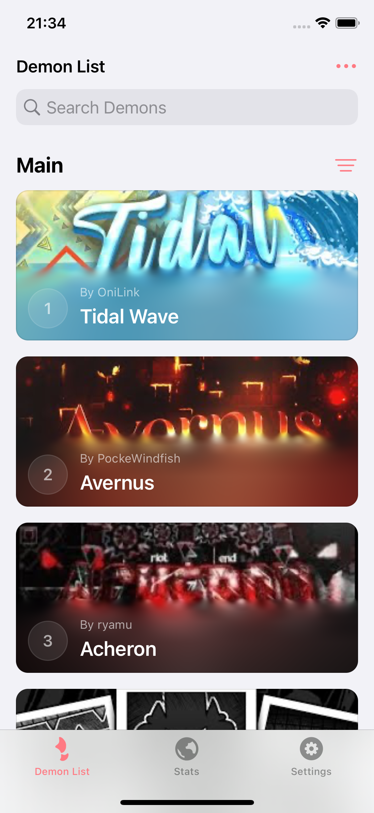
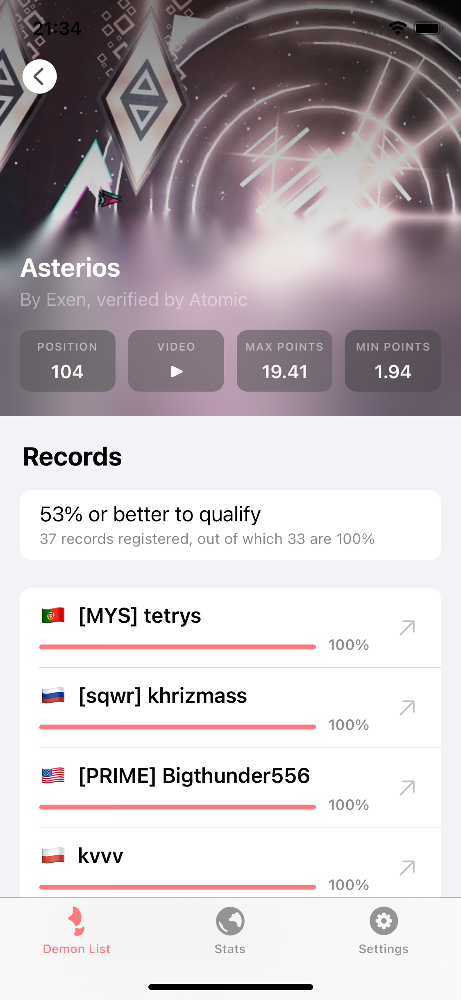
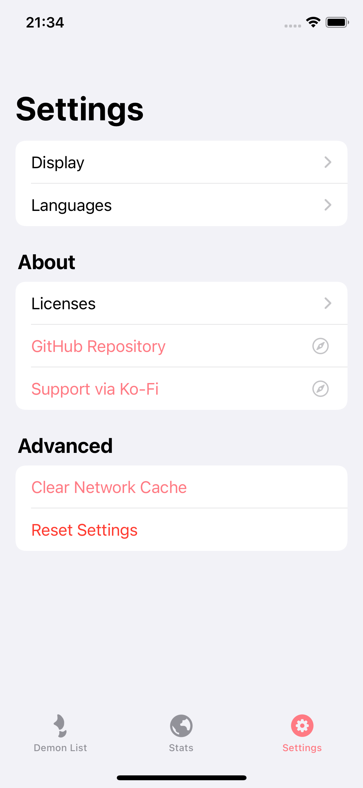

# Pointercrate

Geometry Dash Demonlist application for iOS/iPadOS systems. Android variant can be found [here](https://github.com/wingio/Hellish).

## Preview

| <p align="center"><picture><source media="(prefers-color-scheme: dark)" srcset="Images/List_dark.png"><source media="(prefers-color-scheme: light)" srcset="Images/List_light.png"></picture></p> | <p align="center"><picture><source media="(prefers-color-scheme: dark)" srcset="Images/Info_dark.png"><source media="(prefers-color-scheme: light)" srcset="Images/Info_light.png"></picture></p> | <p align="center"><picture><source media="(prefers-color-scheme: dark)" srcset="Images/Settings_dark.png"><source media="(prefers-color-scheme: light)" srcset="Images/Settings_light.png"></picture></p> | 
|:--:|:--:|:--:| 
| Demon List | Records | Settings |

## Building on macOS
```
gmake package
```

## Credits

<p align="left">
    
    <b><a href="https://github.com/ssalggnikool">Samara</a></b>
    <br>
    <sub>Me</sub>
</p>

<p align="left">
    
    <b><a href="https://github.com/llsc12">llsc12</a></b>
    <br>
    <sub>Pixiv API code / Some help</sub>
</p>

<p align="left">
    
    <b><a href="https://github.com/NSAntoine">Serena</a></b>
    <br>
    <sub>Preferences code from Antoine</sub>
</p>

<p align="left">
    
    <b><a href="https://pointercrate.com/demonlist/">pointercrate</a></b>
    <br>
    <sub>API</sub>
</p>

# 
